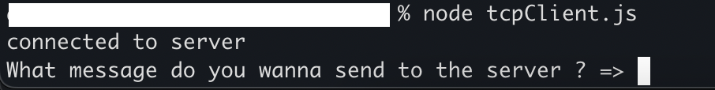
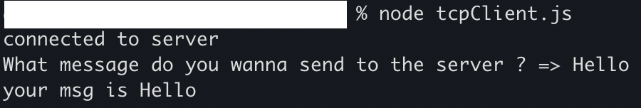
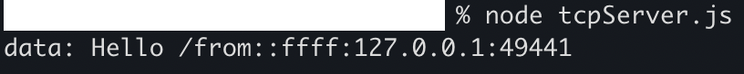

# TCP

## I created a tcp client and server. The client accept an user input. The server output message from the client on console.

## client
### The client waited for the user input

### The user sent "Hello" to the server

## The server received the message

